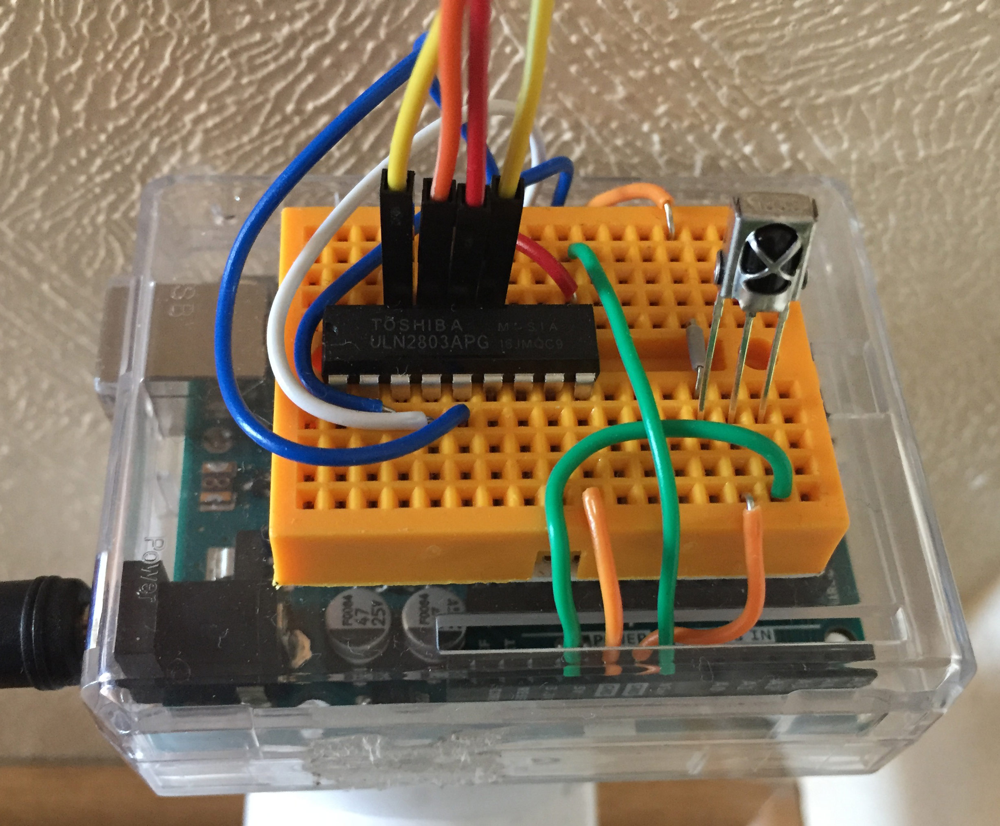

#Tuto 2: How to control RGB LED strip with IR remote ?

##Demo

How to decode IR remote and control RGB LED strip.


##Requirements
- 1 Arduino UNO
- 1 IR receiver
- 1 IR remote
- 1 ULN2803
- 1 9V external power supply
- Jumpers / Breadboard

##Wiring

| IR Receiver     | Arduino   
|-----------------|-------
| VCC             | 5V        
| GND             | GND       
| DATA            | D8 

| ULN2803     | Arduino   
|-------------|----------------------------
| VIN         | 9V (External power supply)
| GND         | GND       
| BLUE        | D9 
| RED         | D10 
| GREEN       | D11 



##Appendix

###Remote codes

####LED strip remote

```
//red
FF1AE5
Decoded NEC: FF1AE5 (32 bits)
Raw (68): 8950 -4400 550 -550 600 -550 500 -600 550 -550 550 -550 550 -550 600 -550 550 -550 550 -1650 550 -1650 600 -1650 550 -1650 550 -1650 600 -1650 500 -1700 550 -1650 600 -500 600 -550 500 -600 550 -1650 550 -1650 550 -600 500 -1700 550 -550 550 -1650 550 -1650 600 -1650 550 -550 550 -550 550 -1650 550 -600 550 -1650 550 

//green
FF9A65
Decoded NEC: FF9A65 (32 bits)
Raw (68): 8900 -4400 600 -500 600 -550 550 -550 550 -550 600 -500 550 -600 550 -550 550 -550 550 -1650 600 -1650 550 -1650 550 -1650 600 -1650 550 -1650 550 -1650 600 -1650 550 -1650 550 -550 550 -550 600 -1650 550 -1650 550 -550 550 -1650 550 -600 550 -500 600 -1650 550 -1650 550 -600 550 -500 650 -1600 600 -500 600 -1600 600 

//blue
FFA25D
Decoded NEC: FFA25D (32 bits)
Raw (68): 9050 -4300 650 -500 600 -500 550 -550 600 -500 650 -500 550 -550 600 -500 600 -500 550 -1650 650 -1600 600 -1600 550 -1650 600 -1600 650 -1600 550 -1650 600 -1600 600 -1650 550 -550 600 -1600 550 -550 600 -500 650 -500 550 -1650 600 -500 600 -550 600 -1600 550 -550 600 -1600 600 -1600 650 -1600 600 -500 600 -1650 600 

//on/off
FF02FD
Decoded NEC: FF02FD (32 bits)
Raw (68): 8900 -4450 550 -500 600 -550 550 -550 550 -550 600 -500 550 -600 550 -550 550 -550 550 -1650 600 -1650 550 -1650 550 -1650 600 -1650 550 -1650 550 -1650 600 -1600 600 -500 600 -550 500 -600 550 -550 600 -500 550 -550 550 -1700 550 -550 550 -1650 550 -1650 600 -1650 550 -1650 550 -1650 600 -1650 550 -550 550 -1650 550 

//diy1
FF30CF
Decoded NEC: FF30CF (32 bits)
Raw (68): 8950 -4350 600 -550 600 -500 550 -550 600 -500 600 -500 600 -500 650 -450 650 -450 600 -1600 650 -1600 600 -1600 600 -1600 650 -1600 600 -1600 550 -1650 650 -1600 600 -500 600 -500 550 -1650 650 -1550 650 -500 600 -500 550 -550 600 -500 650 -1550 650 -1550 600 -550 600 -500 650 -1550 600 -1600 600 -1600 650 -1600 600 

//diy2
FFB04F
Decoded NEC: FFB04F (32 bits)
Raw (68): 8900 -4400 550 -550 600 -500 550 -600 550 -500 600 -550 550 -550 550 -550 600 -500 550 -1650 600 -1650 550 -1650 550 -1650 600 -1650 550 -1650 550 -1650 550 -1650 550 -1650 600 -550 550 -1650 550 -1650 550 -550 550 -550 550 -550 550 -600 550 -550 550 -1650 550 -550 550 -550 550 -1700 500 -1700 550 -1650 550 -1650 550 

//diy3
FF708F
Decoded NEC: FF708F (32 bits)
Raw (68): 8900 -4400 550 -550 600 -500 550 -600 550 -500 600 -550 550 -550 550 -550 600 -500 550 -1650 600 -1650 550 -1650 550 -1650 600 -1650 550 -1650 550 -1650 550 -1650 550 -550 600 -1650 550 -1650 550 -1650 550 -550 550 -550 600 -500 600 -500 550 -1650 600 -550 550 -550 550 -550 550 -1650 550 -1650 550 -1650 600 -1650 550 

//diy4
FF10EF
Decoded NEC: FF10EF (32 bits)
Raw (68): 8900 -4400 550 -550 600 -500 550 -600 550 -500 600 -550 550 -550 550 -550 600 -500 550 -1650 600 -1650 550 -1650 550 -1650 600 -1600 600 -1650 550 -1650 550 -1650 550 -550 600 -500 550 -550 600 -1650 550 -550 550 -550 550 -550 550 -550 550 -1650 550 -1650 600 -1650 550 -550 550 -1650 550 -1650 550 -1650 600 -1650 550 

//diy5
FF906F
Decoded NEC: FF906F (32 bits)
Raw (68): 8900 -4450 550 -550 550 -550 550 -550 550 -550 600 -500 600 -550 550 -550 550 -550 550 -1650 600 -1650 550 -1650 550 -1650 600 -1600 600 -1600 600 -1650 550 -1650 550 -1650 550 -600 550 -500 600 -1650 550 -550 600 -500 550 -600 550 -500 600 -550 550 -1650 600 -1600 600 -500 600 -1650 550 -1650 550 -1650 600 -1650 550 

//diy6
FF50AF
Decoded NEC: FF50AF (32 bits)
Raw (68): 9000 -4400 600 -500 600 -550 550 -550 600 -500 600 -500 600 -550 600 -500 600 -500 550 -1650 600 -1650 600 -1600 550 -1650 650 -1600 600 -1600 550 -1650 650 -1600 600 -500 600 -1600 600 -500 650 -1600 600 -500 600 -500 600 -550 550 -550 550 -1650 600 -500 600 -1650 600 -500 600 -1600 600 -1600 600 -1650 550 -1650 600 

```

####Samsung TV remote

```
//vol +
E0E0E01F
E0E0E01F (32 bits)
Raw (68): 4500 -4400 600 -1600 600 -1650 600 -1600 600 -500 600 -500 600 -500 600 -550 550 -550 550 -1650 600 -1600 600 -1650 550 -550 550 -550 550 -550 600 -500 600 -500 600 -1650 550 -1650 600 -1600 550 -550 600 -500 600 -550 550 -550 550 -550 600 -500 600 -500 600 -500 600 -1650 550 -1650 600 -1600 600 -1600 600 -1650 600 

//vol -
E0E0D02F
E0E0D02F (32 bits)
Raw (68): 4500 -4400 600 -1600 600 -1650 550 -1650 550 -550 550 -550 600 -500 600 -550 550 -550 550 -1650 550 -1650 600 -1650 550 -550 550 -550 600 -500 600 -500 550 -550 600 -1650 550 -1650 600 -500 600 -1600 600 -500 600 -550 550 -550 600 -500 600 -500 600 -500 600 -1600 600 -550 550 -1650 550 -1650 550 -1650 600 -1650 550 

//mute
E0E0F00F
E0E0F00F (32 bits)
Raw (68): 4500 -4400 600 -1650 600 -1600 600 -1600 600 -500 600 -500 600 -550 600 -500 600 -500 600 -1600 600 -1650 550 -1650 600 -500 600 -500 600 -500 600 -500 600 -550 550 -1650 600 -1600 600 -1600 600 -1650 600 -500 600 -500 600 -500 600 -500 600 -500 600 -550 550 -550 600 -500 600 -1600 600 -1600 600 -1650 600 -1600 600 

//src
E0E0807F
E0E0807F (32 bits)
Raw (68): 4450 -4450 550 -1650 550 -1650 550 -1700 500 -600 550 -550 550 -550 550 -550 600 -500 550 -1700 500 -1700 550 -1650 550 -550 550 -600 500 -600 500 -600 550 -550 550 -1650 550 -550 550 -600 500 -600 500 -600 550 -550 550 -550 550 -550 550 -550 550 -1700 550 -1650 550 -1650 550 -1700 500 -1700 550 -1650 550 -1700 500 

//up
E0E006F9
E0E006F9 (32 bits)
Raw (68): 4450 -4450 550 -1650 550 -1700 500 -1700 550 -550 550 -550 550 -550 550 -600 500 -600 500 -1700 550 -1650 600 -1650 500 -600 550 -550 550 -550 550 -550 550 -550 550 -600 500 -600 550 -550 550 -550 550 -550 550 -1650 550 -1700 500 -600 550 -1650 550 -1650 550 -1700 500 -1700 550 -1650 550 -550 550 -550 600 -1650 550 

//down
E0E08679
E0E08679 (32 bits)
Raw (68): 4500 -4450 550 -1650 600 -1600 600 -1600 600 -550 550 -550 600 -500 550 -550 600 -500 600 -1600 600 -1650 600 -1600 550 -550 600 -500 600 -500 600 -550 550 -550 550 -1650 600 -500 600 -500 600 -550 550 -550 550 -1650 600 -1600 600 -500 600 -550 550 -1650 600 -1600 550 -1650 600 -1650 550 -550 550 -550 550 -1650 600 

//enter
E0E016E9
E0E016E9 (32 bits)
Raw (68): 4450 -4450 550 -1700 550 -1650 550 -1650 550 -550 550 -550 600 -500 600 -550 550 -550 550 -1650 550 -1650 600 -1650 550 -550 550 -550 550 -550 550 -550 550 -550 600 -550 550 -550 550 -550 550 -1650 550 -550 600 -1650 550 -1650 550 -550 550 -1650 600 -1650 550 -1650 550 -550 550 -1650 600 -500 600 -550 550 -1650 550 

//on/off samsung
E0E040BF
E0E040BF (32 bits)
Raw (68): 4450 -4450 550 -1650 550 -1700 500 -1700 550 -550 550 -550 550 -550 550 -550 550 -600 500 -1700 550 -1650 550 -1650 550 -600 500 -600 500 -600 550 -550 550 -550 550 -550 550 -1700 550 -550 550 -550 550 -550 550 -550 550 -550 550 -600 500 -1700 550 -550 550 -1650 550 -1700 500 -1700 550 -1650 550 -1650 550 -1700 500 

//a
E0E036C9
E0E036C9 (32 bits)
Raw (68): 4500 -4400 600 -1650 550 -1650 600 -1600 600 -500 600 -550 550 -550 600 -500 600 -500 600 -1600 600 -1650 550 -1650 600 -500 550 -550 600 -500 600 -500 600 -550 550 -550 600 -500 600 -1600 600 -1600 600 -550 550 -1650 550 -1650 600 -500 600 -1650 600 -1600 600 -500 600 -500 600 -1600 600 -550 600 -500 600 -1600 600 

//b
E0E028D7
E0E028D7 (32 bits)
Raw (68): 4450 -4450 600 -1600 600 -1650 600 -1600 550 -550 600 -500 600 -550 550 -550 550 -550 550 -1650 550 -1650 600 -1650 550 -550 600 -500 600 -500 550 -550 600 -500 600 -550 550 -550 550 -1650 550 -550 600 -1600 600 -550 550 -550 550 -550 550 -1650 600 -1600 600 -550 550 -1650 600 -500 550 -1650 600 -1650 550 -1650 550 

//c
E0E0A857
E0E0A857 (32 bits)
Raw (68): 4500 -4450 600 -1600 600 -1600 600 -1600 600 -550 600 -500 550 -550 600 -500 550 -550 600 -1650 550 -1650 600 -1600 600 -500 600 -500 600 -550 550 -550 600 -500 600 -1600 600 -500 600 -1650 550 -550 550 -1650 600 -500 600 -500 600 -500 600 -550 550 -1650 550 -550 550 -1650 600 -500 600 -1650 600 -1600 600 -1600 600 

//d
E0E06897
E0E06897 (32 bits)
Raw (68): 4500 -4400 600 -1650 550 -1650 550 -1650 600 -500 600 -500 600 -550 550 -550 550 -550 550 -1650 600 -1600 600 -1650 600 -500 600 -500 550 -550 600 -500 600 -500 600 -550 550 -1650 600 -1600 600 -500 600 -1650 550 -550 550 -550 600 -500 550 -1650 600 -500 600 -550 550 -1650 600 -500 600 -1600 600 -1650 550 -1650 550 

```

####Sony speaker remote

```
//play
6626
Decoded SONY: 6626 (15 bits)
Raw (32): 2450 -550 1200 -600 1200 -550 650 -500 650 -550 1250 -550 1250 -500 650 -550 600 -600 650 -500 1250 -500 700 -500 650 -550 1250 -500 1250 -550 600 

//off
7522
Decoded SONY: 7522 (15 bits)
Raw (32): 2400 -600 1150 -600 1200 -600 1150 -600 600 -600 1150 -600 600 -600 1200 -550 600 -600 600 -600 1150 -600 600 -600 550 -600 600 -600 1200 -600 550 

//prev
6126
Decoded SONY: 6126 (15 bits)
Raw (32): 2350 -600 1200 -550 1200 -600 550 -600 600 -600 600 -600 550 -600 1200 -600 550 -600 600 -600 1200 -600 600 -550 600 -600 1150 -600 1200 -600 600 

//next
1126
Decoded SONY: 1126 (15 bits)
Raw (32): 2350 -600 600 -600 600 -600 1200 -550 600 -600 550 -600 600 -600 1200 -600 550 -600 600 -600 1150 -600 600 -600 600 -600 1150 -600 1200 -600 550 

//vol+
2422
Decoded SONY: 2422 (15 bits)
Raw (32): 2400 -550 600 -600 1200 -550 600 -600 600 -550 1250 -550 600 -600 600 -550 650 -550 600 -600 1200 -550 600 -600 600 -550 650 -550 1200 -600 600 

//vol-
6422
Decoded SONY: 6422 (15 bits)
Raw (32): 2350 -600 1200 -550 1200 -600 600 -550 600 -600 1200 -600 600 -550 600 -600 600 -600 600 -550 1200 -600 600 -550 650 -550 600 -600 1200 -550 600 
```
