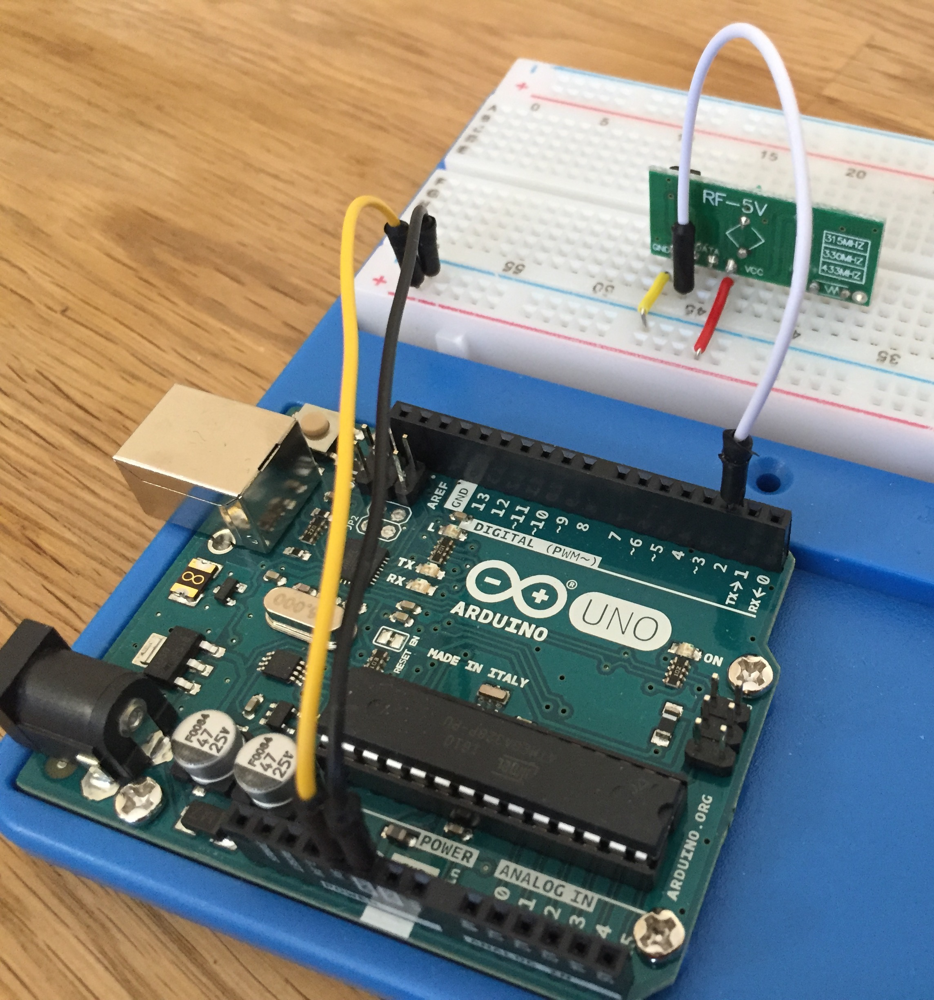

#Tuto 3: How to decode 433MHz RF remote codes ?

##Demo

Example for receiving 433MHz codes from Chacon & Zap remotes using rc-switch library.


##Requirements
- 1 Arduino UNO
- 1 433MHz receiver
- 1 433MHz remote
- Jumpers / Breadboard

##Wiring
  
| Receiver   | Arduino
|------------|---------
| VCC        | 5V
| GND        | GND
| DATA       | D2



##Appendix

###Remote codes

####Zap remote

```
1: ON
Decimal: 4265267 (24Bit) Binary: 010000010001010100110011 Tri-State: F00F0FFF0101 PulseLength: 182 microseconds Protocol: 1
Raw data: 5748,152,584,528,192,168,592,148,588,148,584,152,580,156,592,520,196,168,584,152,588,152,584,524,196,168,604,508,196,164,600,512,200,164,604,128,608,136,592,152,576,164,576,148,584,160,576,160,588,

2: ON
Decimal: 4265216 (24Bit) Binary: 010000010001010100000000 Tri-State: F00F0FFF0000 PulseLength: 182 microseconds Protocol: 1
Raw data: 5756,148,576,532,200,172,568,164,580,156,588,152,576,160,580,532,188,172,592,144,596,140,588,528,192,168,592,524,196,168,596,508,200,164,596,140,604,140,592,140,592,144,596,140,592,148,584,156,584,

3: ON
Decimal: 4265728 (24Bit) Binary: 010000010001011100000000 Tri-State: F00F0FF10000 PulseLength: 183 microseconds Protocol: 1
Raw data: 5764,148,584,508,208,156,604,136,596,140,600,136,608,128,608,500,212,152,608,132,604,132,604,512,200,164,596,516,200,160,600,516,200,164,592,140,600,136,608,128,600,140,596,144,596,136,600,88,132,

4: ON
Decimal: 4267267 (24Bit) Binary: 010000010001110100000011 Tri-State: F00F0F1F0001 PulseLength: 181 microseconds Protocol: 1
Raw data: 5756,136,592,524,200,168,592,140,588,152,588,148,588,152,572,540,192,168,580,160,576,168,572,532,192,544,196,540,204,168,584,16,512,188,168,600,136,588,152,592,140,596,148,588,148,592,516,204,544,

5: ON
Decimal: 4273411 (24Bit) Binary: 010000010011010100000011 Tri-State: F00F01FF0001 PulseLength: 183 microseconds Protocol: 1
Raw data: 5756,152,592,512,196,164,596,140,596,144,600,136,596,140,600,512,204,160,596,140,600,136,596,520,196,168,596,512,204,160,600,508,204,164,600,132,604,132,604,136,596,144,596,140,596,144,588,1156,64,

1: OFF
Decimal: 4265276 (24Bit) Binary: 010000010001010100111100 Tri-State: F00F0FFF0110 PulseLength: 182 microseconds Protocol: 1
Raw data: 5764,132,604,504,212,160,596,136,604,132,600,136,604,140,596,516,196,164,596,140,600,132,604,512,204,156,600,516,196,172,588,520,196,168,592,144,596,132,604,136,604,136,600,136,596,144,592,140,600,

2: OFF
Decimal: 4259840 (24Bit) Binary: 010000010000000000000000 Tri-State: F00F00000000 PulseLength: 182 microseconds Protocol: 1
Raw data: 5760,144,596,508,208,164,592,144,596,136,600,136,600,140,600,512,200,164,596,136,604,136,596,516,200,164,604,504,208,160,600,512,196,168,592,140,600,136,604,136,596,140,604,132,600,136,596,140,600,

3: OFF
Decimal: 4265740 (24Bit) Binary: 010000010001011100001100 Tri-State: F00F0FF10010 PulseLength: 182 microseconds Protocol: 1
Raw data: 5756,156,576,528,196,168,592,144,592,148,584,152,588,144,592,528,188,164,600,140,584,164,576,532,192,172,576,532,196,544,200,540,192,168,592,140,596,144,592,144,596,140,596,144,592,140,600,140,588,

4: OFF
Decimal: 4267276 (24Bit) Binary: 010000010001110100001100 Tri-State: F00F0F1F0010 PulseLength: 181 microseconds Protocol: 1
Raw data: 5748,160,576,532,192,172,568,172,572,160,580,160,580,156,580,528,192,172,588,148,588,152,576,536,192,540,196,548,188,176,584,524,192,176,588,144,592,144,592,148,584,148,596,144,584,160,576,152,584,

5: OFF
Decimal: 4273420 (24Bit) Binary: 010000010011010100001100 Tri-State: F00F01FF0010 PulseLength: 181 microseconds Protocol: 1
Raw data: 5748,152,584,528,188,184,568,160,576,164,572,164,568,164,580,536,188,172,588,148,588,152,576,548,172,180,588,524,188,172,592,520,192,172,592,144,592,140,592,148,596,136,596,144,596,144,592,144,588,

```

####Chacon remote

```
1: ON
Decimal: 1376256 (24Bit) Binary: 000101010000000000000000 Tri-State: 0FFF00000000 PulseLength: 446 microseconds Protocol: 1
Raw data: 13840,440,1344,436,1416,340,1444,1228,560,332,1452,1228,564,328,1444,1232,560,332,1444,1236,552,340,1440,1232,552,340,1444,1236,552,336,1448,1228,556,340,1448,1228,548,340,608,16,368,72,380,48,60,252,156,672,96,

2: ON
Decimal: 1394005 (24Bit) Binary: 000101010100010101010101 Tri-State: 0FFFF0FFFFFF PulseLength: 445 microseconds Protocol: 1
Raw data: 13900,372,1416,368,1412,376,1404,1268,508,384,1412,1260,520,376,1416,1260,516,372,1408,1268,508,384,1408,1272,516,372,1420,1252,520,372,1420,1260,528,360,1416,1260,520,372,1416,1256,520,380,1416,1256,524,1256,528,1256,848,

3: ON
Decimal: 1376256 (24Bit) Binary: 000101010000000000000000 Tri-State: 0FFF00000000 PulseLength: 445 microseconds Protocol: 1
Raw data: 13900,376,1408,372,1408,380,1408,1264,520,372,1408,1272,496,392,1408,1268,508,384,1412,1260,524,368,1416,1264,512,376,1416,1264,512,376,1408,1268,524,372,1412,1264,524,364,1416,1264,512,376,1416,1256,532,1252,528,1256,532,

4: ON
Decimal: 1397845 (24Bit) Binary: 000101010101010001010101 Tri-State: 0FFFFFF0FFFF PulseLength: 445 microseconds Protocol: 1
Raw data: 13900,376,1404,380,1404,384,1400,1268,516,380,1408,1260,520,372,1420,1260,520,372,1404,1272,500,388,1404,1272,512,380,1420,1256,516,376,1416,1260,516,376,1416,1260,516,372,1412,1264,528,368,1412,1264,516,1264,524,1256,532,

1: OFF
Decimal: 1381716 (24Bit) Binary: 000101010001010101010100 Tri-State: 0FFF0FFFFFF0 PulseLength: 446 microseconds Protocol: 1
Raw data: 13836,440,1348,436,1368,388,1436,1236,556,336,1440,1236,556,340,1444,1228,560,332,1448,1232,536,356,1436,1236,552,340,1444,1232,552,340,1444,1228,560,336,1440,1236,556,336,1436,1240,548,344,1440,928,136,504,16,56,588,

2: OFF
Decimal: 1393920 (24Bit) Binary: 000101010100010100000000 Tri-State: 0FFFF0FF0000 PulseLength: 446 microseconds Protocol: 1
Raw data: 13836,436,1348,436,1412,344,1440,1232,556,336,1440,1232,564,332,1448,1224,556,340,1440,1236,544,344,1440,1236,552,340,1444,1236,552,336,1440,1236,556,336,1444,1236,544,344,1436,68,560,36,1340,40,488,88,524,136,20,

3: OFF
Decimal: 1398100 (24Bit) Binary: 000101010101010101010100 Tri-State: 0FFFFFFFFFF0 PulseLength: 446 microseconds Protocol: 1
Raw data: 13828,440,1348,436,1344,436,1360,1284,564,328,1448,1228,564,328,1452,1224,564,328,1448,1228,556,336,1440,1236,556,332,1448,1228,560,336,1444,1232,552,336,1448,1232,552,336,1444,136,500,120,1080,40,40,1560,136,460,120,

4: OFF
Decimal: 1397844 (24Bit) Binary: 000101010101010001010100 Tri-State: 0FFFFFF0FFF0 PulseLength: 446 microseconds Protocol: 1
Raw data: 13836,432,1352,440,1344,436,1416,1228,560,332,1452,1224,556,336,1448,1228,560,332,1448,1228,552,336,1448,1232,560,332,1444,1228,560,332,1440,1240,552,340,1436,1240,540,352,1432,1244,152,32,1880,44,1296,492,76,760,72,
```

