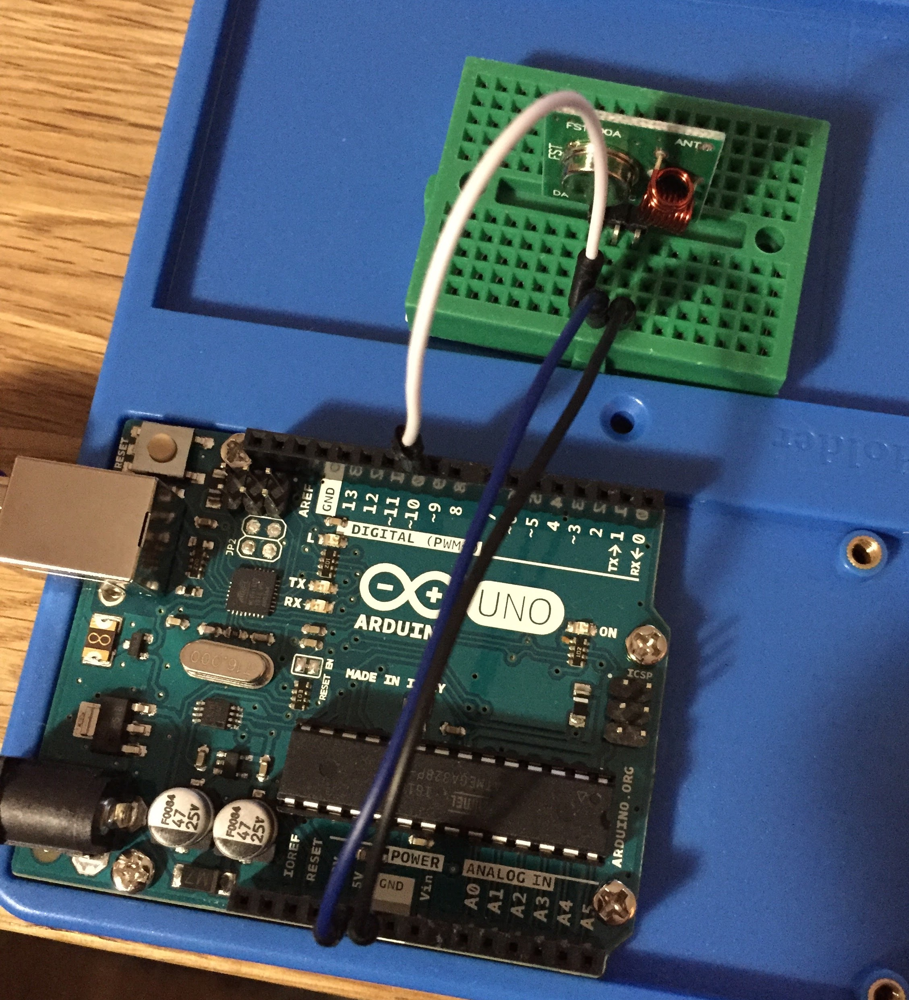

#Tuto 4: How to send 433MHz RF codes to power outlets ?

##Demo

Example for sending code from Arduino to Chacon power outlets.

##Requirements
- 1 Arduino UNO
- 1 433MHz transmitter
- Jumpers / Breadboard

##Wiring

| Transmitter | Arduino   | Wemos D1
|-------------|-----------|----------
| VCC         | 5V        | 5V
| GND         | GND       | GND
| DATA        | D10       | D1

