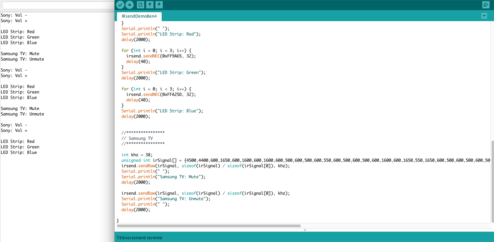

# Tuto 8: How to send IR code with an Arduino ?

## Demo

This sketch sends IR codes to control devices :

- Samsung TV
- Sony speaker system 
- LED Strip with IR receiver
- and all other IR devices (Working with a simple IR remote control)

## Requirements

  - 1 IR LED
  - 1 Arduino UNO
  - 1 mini breadboard
  - Jumpers

## Wiring

| IR LED | Arduino   
|--------|-------
| -      | GND       
| +      | D3 

